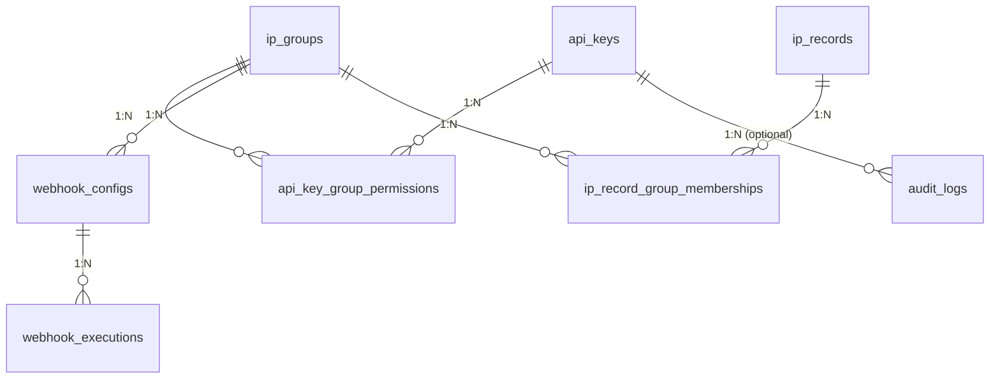

# Simply IP Vault - Database Schema & Entity Specifications

This document defines the complete database schema for `simply_ip_vault`. All entities are managed through **SeaORM** (2.0+) and must remain strictly **SQL-agnostic** (compatible with SQLite, PostgreSQL, and MySQL).

---

## 📊 Entity Relationship Diagram

### Mermaid Diagram (For GitHub / Forgejo / Markdown Previewers)



### Compact ASCII Diagram (Narrow Layout)

```
       [api_keys]
           │
           │ 1:N
           ▼
[api_key_group_permissions]
           ▲
           │ N:1
           │
      [ip_groups] ───► (1:N) ───► [webhook_configs] ───► (1:N) ───► [webhook_executions]
           │
           │ 1:N
           ▼
[ip_record_group_memberships]
           ▲
           │ N:1
           │
     [ip_records]

  [api_keys] ───► (1:N) ───► [audit_logs]
```

---

## 📁 Tables & Entities Specifications

### 1. `api_keys`
Stores authentication tokens, global access rights, and CIDR network binding rules.

| Field | Type | Attributes | Description |
| :--- | :--- | :--- | :--- |
| `id` | `UUID` | Primary Key, Auto-Gen | Unique identifier for the API key |
| `name` | `String` | Not Null | Human-readable key description |
| `key_hash` | `String` | Not Null, Unique | Argon2 / SHA-256 hash of the secret API key |
| `signing_secret` | `Text` | Nullable | Per-key HMAC-SHA256 secret used to verify the `X-Signature-256` request header. Encrypted with XChaCha20-Poly1305 when `VAULT_ENCRYPTION_KEY` (alias `SIGNING_SECRET_KEY`, exactly 64 hex characters) is set, stored as `v1.xchacha20poly1305.<hex nonce>.<hex ciphertext‖tag>`; hex-encoded but unencrypted as `v1.plain.<hex>` otherwise. **Those two prefixes are the complete set** — any other value, including the retired `aesgcm256:` shape and an unprefixed bare secret, is rejected as `MalformedCiphertext` (`500`) rather than read; see the fail-closed note below. `NULL` only for keys created before this column existed — such keys cannot authenticate and must be rotated. Never returned by any read endpoint |
| `prefix` | `String` | Not Null, Indexed | First 8 characters of key for display and fast lookup |
| `is_master` | `Boolean` | Default: `false` | Bypasses all group permission checks. **Bootstrap-only** — the field is not present on `CreateApiKeyPayload` or `UpdateApiKeyPayload` at all, and both carry `#[serde(deny_unknown_fields)]`, so a request naming it is refused by deserialization with `400` before any handler runs (`RBAC_MODEL.md` §5: "Removing the field from the payload type is required; rejecting it at the handler is not sufficient"). Written by `bootstrap_master_key` and nowhere else. **Not sufficient on its own at runtime:** the service pins the Master's `id` at boot and treats this column as authoritative only for that id, so setting it on another row in a live database has no effect — see "Master Uniqueness" below |
| `master_marker` | `Integer` | **Generated**, Nullable, **Unique** | `GENERATED ALWAYS AS (CASE WHEN is_master THEN 1 ELSE NULL END)` — derived by the **database engine**, never written by anything. Carries no authority and is read by no guard; it exists so a plain unique index can express "at most one Master" in the schema itself, which `RBAC_MODEL.md` §5 requires be enforced by the database rather than by application logic. A **marker column** rather than a partial unique index on `is_master = true`, because MySQL has no partial indexes and the data layer must stay SQL-agnostic; NULLs do not collide in a unique index on any supported engine, so every non-master row coexists freely. **Deliberately absent from `api_key::Model`**: SeaORM builds column lists from the entity, so omitting it is what guarantees no query names it — and every engine rejects an `INSERT`/`UPDATE` that does. Storage class is per-engine (Postgres `STORED`, SQLite/MySQL `VIRTUAL`) and pinned by unit test. See the migration note below |
| `can_manage_keys` | `Boolean` | Default: `false` | Global privilege to create/edit/delete API keys. Grantable **only by the Master key** (`RBAC_MODEL.md` R4). Confers no authority over any group on its own — see the conjunction under `api_key_group_permissions` |
| `can_manage_webhooks` | `Boolean` | Default: `false` | Global privilege to manage webhook configurations. Grantable **only by the Master key** — this service's spelling of the specification's `can_create_webhooks`, a resource-creation right, which §1 places at the same tier as `can_manage_keys` and R4 makes Master-only. Previously delegable, which made it freely amplifiable (a parent that did not hold it could hand it out) |
| `can_create_groups` | `Boolean` | Default: `false` | Global privilege to create new IP groups. Grantable **only by the Master key** (R4) |
| `parent_key_id` | `UUID` | Nullable, Indexed | The key that created this one. `NULL` for the Master and for every pre-migration row. **Confers no authority** — `RBAC_MODEL.md` R3: it "exists solely for cascading deletion and visibility scoping … Rights are never derived from key lineage." No permission guard reads it. No database-level FK (see the note below) |
| `bound_ips` | `Text` | Nullable | Comma-separated CIDR ranges allowed to use this key (e.g. `127.0.0.1/32,::/0`) |
| `created_at` | `DateTimeUtc` | Not Null | Key generation timestamp |
| `updated_at` | `DateTimeUtc` | Not Null | Key last update timestamp |

---

*Credential model:* an API key is a **pair** of independent secrets. `key_hash` is a one-way hash of
the public `X-API-Key` (identity — never recoverable). `signing_secret` proves possession and
therefore **cannot** be hashed, since verifying an HMAC requires the secret verbatim; it is encrypted
at rest instead. Both are returned exactly once, by `POST /api/keys` and `POST /api/keys/{id}/rotate`.
`POST /api/keys/{id}/rotate` replaces both, so a compromised key leaves no working credential behind.
The cipher protecting this column is built **once at startup** from `VAULT_ENCRYPTION_KEY` and
carried in `AppState`; it is never re-derived per request. A malformed key aborts startup rather
than silently falling back to plaintext.

*Fail-closed decryption (2026-08-02):* `SecretCipher::open` accepts exactly the two prefixes above
and errors on everything else. Two shapes were retired, in that order:

1. An **unprefixed value** was previously returned verbatim as a pre-prefix-era compatibility path.
   That is gone, because "no recognized prefix" identifies a pre-prefix row only by assumption, while
   a truncated column, a half-written seal, a botched migration, or a value written through an
   unrelated defect all reach the same branch — and each ends with unknown bytes used as HMAC key
   material and nothing in the logs to say so.
2. The **`aesgcm256:` read path** was a decrypt-only bridge for rows written before
   XChaCha20-Poly1305, with no writer anywhere in the codebase. It has been removed along with the
   `aes-gcm` dependency and the SHA-256-of-the-raw-env-text derivation that produced its key.

A deployment still holding either shape must run `POST /api/keys/{id}/rotate-secret` (master-only)
before upgrading, or that key stops authenticating with a `500`. Rotation touches only
`signing_secret`, leaving `key_hash`, `prefix`, `name`, `bound_ips`, the scope flags and every
`api_key_group_permissions` row intact. To find stragglers first:

```sql
SELECT id, name, prefix FROM api_keys
WHERE signing_secret IS NOT NULL AND signing_secret NOT LIKE 'v1.%';
```

`POST /api/keys/{id}/rotate-secret` replaces **only** `signing_secret`, leaving `key_hash`, `prefix`,
`name`, `bound_ips`, the global scope flags and every `api_key_group_permissions` row untouched — the
narrow operation for routine hygiene, and the recovery path for a `NULL` `signing_secret`.

---

### 2. `ip_groups`
Logical collections of IP rules (e.g. `fail2ban`, `sshd`, `vpn_whitelist`).

| Field | Type | Attributes | Description |
| :--- | :--- | :--- | :--- |
| `id` | `UUID` | Primary Key, Auto-Gen | Unique identifier for the group |
| `name` | `String` | Not Null, Unique, Indexed | Group name used in API requests and UI |
| `group_type` | `String` | Not Null, Default: `'banlist'` | Type of group: `'banlist'` or `'whitelist'` |
| `description` | `Text` | Nullable | Optional detailed description of the group's purpose |
| `owner_key_id` | `UUID` | Nullable, Indexed | The key holding **lifecycle authority** over this group (§3): deleting or renaming the group itself is restricted to the Master and this key. Holding `can_manage` on its permission rows, or any read/write/delete verb over its contents, confers none of it. `NULL` means unassigned, which reads as master-only; set on creation to the creating key (`NULL` when a master creates it), and reassignable by a master through `PUT /api/groups/{id}/owner` |
| `created_at` | `DateTimeUtc` | Not Null | Group creation timestamp |

---

### 3. `api_key_group_permissions` (M:N Junction Table)
Maps fine-grained read, write, delete, and administrative permissions per API key and per IP group.

| Field | Type | Attributes | Description |
| :--- | :--- | :--- | :--- |
| `id` | `UUID` | Primary Key, Auto-Gen | Unique identifier |
| `api_key_id` | `UUID` | FK -> `api_keys.id` (CASCADE) | Associated API Key |
| `group_id` | `UUID` | FK -> `ip_groups.id` (CASCADE) | Associated IP Group |
| `can_read` | `Boolean` | Default: `true` | Permission to view IPs within this group |
| `can_write` | `Boolean` | Default: `false` | Permission to add/update IPs in this group |
| `can_delete` | `Boolean` | Default: `false` | Permission to remove IPs from this group |
| `can_manage` | `Boolean` | Not Null, Default: `false` | Permission to administer **this group's** permission rows — the resource half of `RBAC_MODEL.md` R2's conjunction. Confers nothing on its own: every administrative action also requires the global `api_keys.can_manage_keys`, and that scope in turn confers nothing on a group where this column is `false`. Never auto-provisioned: creating a group confers read/write/delete and not this |
| `created_at` | `DateTimeUtc` | Not Null | Assignment timestamp |

*Constraints & Indexes:*
- Unique Index: `(api_key_id, group_id)`

*Authority summary* — the two columns that grant authority over this table are **conjunctive**, not
alternative (`RBAC_MODEL.md` R2: "Neither alone is sufficient"):

| Caller holds | Create a row, or add/widen a verb | Remove a verb, lower a row, or delete a row |
| :--- | :--- | :--- |
| Global `can_manage_keys` only | ❌ | ❌ |
| Per-group `can_manage` only | ❌ | ❌ |
| **Both** | ✅, and only up to the verbs the caller itself holds | ✅, with no proof over the verb removed |
| `api_keys.is_master` | ✅ | ✅ |

`can_manage_keys` is authority over **credentials** and says nothing about which groups the caller may
reach — on its own it made per-group RBAC advisory. `can_manage` is authority over **one resource** and
says nothing about whether the caller is trusted with credentials at all — on its own it admitted a key
holding no global scope to rewriting other keys' access.

The asymmetry that remains is *within* the grant direction, not between the two columns: conferring a
verb can raise authority above the caller's own, so each verb is checked against the caller's own row
(R1/R7), while removing one raises nobody's and needs no such proof (R6). `can_manage` is itself
treated as a verb on the grant path, which is what implements R5 — manage may propagate sideways
between parents and never upward to a daughter, since the recipient still needs `can_manage_keys`.

---

### 4. `ip_records`
Stores banned or whitelisted IP addresses and CIDR subnets.

| Field | Type | Attributes | Description |
| :--- | :--- | :--- | :--- |
| `id` | `UUID` | Primary Key, Auto-Gen | Unique record identifier |
| `target_address` | `String` | Not Null, Unique, Indexed | Valid IPv4/IPv6 address or CIDR range (e.g. `192.168.1.50/32`, `2001:db8::/32`), stored exactly as submitted. Unique so re-registration updates the existing row instead of creating a duplicate |
| `cause` | `Text` | Nullable | Reason for adding the IP record |
| `is_locked` | `Boolean` | Default: `false` | When `true`, the record cannot be modified or deleted through the API regardless of caller permissions. No endpoint currently sets this; it is a manual/administrative safeguard |
| `created_at` | `DateTimeUtc` | Not Null | Initial insertion timestamp |
| `updated_at` | `DateTimeUtc` | Not Null | Timestamp of the last field update (cause change or re-registration) |
| `last_seen_at` | `DateTimeUtc` | Not Null, Indexed | Timestamp of last re-registration or recorded activity |
| `is_deleted` | `Boolean` | Not Null, Default: `false`, Indexed | Soft-delete flag. A `true` row is hidden from every read (including the `iplist` export) and from webhook dispatch, but survives for the retention window so a master key can inspect or restore it |
| `deleted_at` | `DateTimeUtc` | Nullable, Indexed | When the soft delete happened; `NULL` while live. This — not `updated_at` — is what the purge measures against, so restoring and re-deleting restarts the retention clock |
| `deleted_by` | `Text` | Nullable | The `api_keys.id` (as text) of whoever soft-deleted the row. Deliberately **not** a foreign key: a FK would either block deleting that key or null the attribution out, and an attribution that disappears with its actor is not an attribution |

*Soft-delete lifecycle:*
- `DELETE /api/ips/{id}` soft-deletes. Non-master keys can only ever soft-delete; `?hard=true` is master-only and drops the row (cascading to `ip_record_group_memberships`).
- `GET /api/ips?include_deleted=true` is the master-only trash view. The flag is ignored for non-masters rather than rejected, and a master's *default* listing still hides deleted rows — the trash is opt-in.
- `POST /api/ips/{id}/restore` (master only) clears all three columns, so a restored row is indistinguishable from one never deleted.
- Re-registering a soft-deleted `target_address` via `/api/ban` or `/api/white` **resurrects** it rather than colliding with the unique index — otherwise a delete would permanently deny that address until the trash was emptied.
- `POST /api/system/purge-ips` (master only) and the background worker in `src/retention.rs` permanently drop rows where `is_deleted = true` **and** `deleted_at` is older than `IP_RETENTION_DAYS` (default **92**). Both conditions are required: matching on the timestamp alone would destroy restored records that kept a stale `deleted_at`.

*Note:* `DELETE /api/ips` (query/body form) is a different operation — it removes a record's membership in **one group** and leaves the record itself untouched. The `{id}` route above acts on the record as a whole.

---

### 5. `ip_record_group_memberships` (M:N Junction Table)
Associates an IP record with one or multiple IP groups.

| Field | Type | Attributes | Description |
| :--- | :--- | :--- | :--- |
| `ip_record_id` | `UUID` | FK -> `ip_records.id` (CASCADE) | Target IP Record ID |
| `group_id` | `UUID` | FK -> `ip_groups.id` (CASCADE) | Associated Group ID |

*Constraints & Indexes:*
- Primary Key: Composite `(ip_record_id, group_id)`

---

### 6. `webhook_configs`
Defines HTTP endpoints to notify when IP events occur within a specific group.

| Field | Type | Attributes | Description |
| :--- | :--- | :--- | :--- |
| `id` | `UUID` | Primary Key, Auto-Gen | Unique webhook configuration ID |
| `name` | `String` | Not Null | Human-readable name for the webhook |
| `target_url` | `String` | Not Null | HTTP/HTTPS target endpoint URL. Supports the same `$variable` substitution as `payload_template` (see below), resolved fresh against each triggering event before every dispatch |
| `secret_token` | `String` | Not Null | Shared secret used to generate the HMAC SHA-256 signature (`X-Signature-256`). Empty string in the modes that compute no signature. Never returned by `GET /api/webhooks` |
| `auth_mode` | `Text` | Not Null, Default: `'CANONICAL_V1'` | How dispatches authenticate — one of `'CANONICAL_V1'`, `'HMAC_ONLY'`, `'API_KEY_ONLY'`, `'NONE'` (see the table below). Unrecognized stored values fall back to `'HMAC_ONLY'`, never to `'NONE'` |
| `api_key` | `Text` | Nullable | Value sent as the `X-API-Key` header by `'CANONICAL_V1'` and `'API_KEY_ONLY'`. A plaintext credential for the *receiving* system, so it is stored verbatim (there is nothing here to verify it against) and never returned by `GET /api/webhooks` — the listing reports only `has_api_key` |
| `hmac_template` | `Text` | Nullable, Default: `'{method}\n{path}\n{timestamp}\n{body}'` | The string signed in `'CANONICAL_V1'` mode. `NULL` means the default. Only meaningful for `'CANONICAL_V1'` |
| `signature_header` | `String` | Nullable | Header the signature is sent in. NULL means `X-Signature-256`. For receivers expecting a different name (`X-Hub-Signature-256`). Added by `m20260811_000012` |
| `signature_prefix` | `String` | Nullable | Prefix on the hex digest. NULL means `sha256=`; an explicit `""` sends a bare digest. The empty string is a *meaningful* value here, not an unset one. Added by `m20260811_000012` |
| `headers_json` | `Text` | Nullable | Custom JSON key-value object of HTTP headers to inject into requests |
| `payload_template` | `Text` | Not Null | Template string with dynamic variables (e.g. `{"ip":"$target_address","action":"$action","group":"$group_name"}`) |
| `group_id` | `UUID` | FK -> `ip_groups.id` (CASCADE) | Monitored IP Group |
| `is_active` | `Boolean` | Default: `true` | Toggle to enable/disable webhook dispatching |
| `events` | `String` | Nullable | Comma-separated subset of `IP_ADD`/`IP_UPDATE`/`IP_DELETE` this webhook fires on. `NULL` means all events |
| `created_at` | `DateTimeUtc` | Not Null | Creation timestamp |

*Auth modes:*

| `auth_mode` | Signed message | Headers dispatched | Requires |
| :--- | :--- | :--- | :--- |
| `CANONICAL_V1` *(default)* | the resolved `hmac_template` | `X-Signature-256: sha256=<hex>`, `X-Timestamp`, and `X-API-Key` when `api_key` is set | `secret_token` |
| `HMAC_ONLY` | `RAW_BODY` | the signature **and nothing else** — no `X-API-Key` even when `api_key` is set, no `X-Timestamp` | `secret_token` |
| `API_KEY_ONLY` | *(none)* | `X-API-Key` | `api_key` |
| `NONE` | *(none)* | *(none)* | — |

Both signing modes send the digest under `signature_header` (NULL ⇒ `X-Signature-256`) with
`signature_prefix` prepended (NULL ⇒ `sha256=`, explicit `""` ⇒ bare digest). **The algorithm is
always SHA-256 and is deliberately not configurable** — making it selectable would mean accepting
SHA-1 for the receivers most likely to ask, and this service would then be generating signatures it
knows to be forgeable.

`HMAC_ONLY` was named `BODY_ONLY` before `m20260811_000012`. The old spelling described the HMAC's
*input* and left the security-relevant half — that the mode sends no bearer credential — to be
inferred. It is still accepted on input for compatibility and is never emitted.

*`hmac_template` substitution rules:*

- Placeholders `{method}`, `{path}`, `{timestamp}`, `{body}` are replaced by their values. `{path}` is
  taken from `target_url` via `url.path()`. Any other `{...}` is literal text.
- `\n`, `\r`, `\t`, `\\` are escape sequences expanded to the characters they name; every other
  backslash sequence is kept verbatim. They are stored as two-character escapes because the template
  is edited in a single-line HTML input where a real newline cannot be typed.
- Both substitutions happen in **one left-to-right pass**, so a value substituted in is never
  rescanned — a request body containing the text `{path}` or `\n` cannot inject field boundaries into
  the signed string.
- A literal path written into the template (e.g. `{method}\n/api/hooks/42/execute\n{timestamp}\n{body}`)
  therefore overrides the `{path}` derived from `target_url`, which is what makes a receiver behind a
  path-rewriting reverse proxy verifiable without an extra column.
- `{body}` is mandatory (enforced with `400` at the API boundary): a signature that does not cover the
  payload is replayable across payloads.

*`target_url`/`payload_template` substitution rules (`dispatch::resolve_event_variables`):*

- Placeholders: `$target_address`/`$ip` (the event's address), `$action`/`$event`
  (`IP_ADD`/`IP_UPDATE`/`IP_DELETE`/`TEST`), `$cause` (the event's cause, or `"Unknown"` if none),
  `$group_name`/`$group_id` (the event's group, or empty if it has none), `$timestamp` (the
  dispatch's Unix timestamp — the same value `CANONICAL_V1` signs and sends as `X-Timestamp`).
- One evaluator, shared by both columns, so a webhook's destination can route on the same event data
  its body carries. Resolution happens *before* `CANONICAL_V1`'s `{path}` is derived, so the
  signature always covers the path the receiver actually gets on the wire, never the unresolved
  template.
- Same single left-to-right, no-rescan discipline as `hmac_template` above, and for the same reason:
  `cause` is caller-controlled (via `/api/ban`/`/api/white`), so a value that happens to contain
  another variable's placeholder text (e.g. a cause of `"$group_name"`) must not be expanded a
  second time.
- The resolved `target_url` is re-screened by the SSRF filter on every dispatch like any other
  target — a variable is safest confined to the path or query; putting one in the URL's host trades
  some of the operator's own control over the destination to whoever can set that variable's source
  field (see the Web UI's Template Variables reference for the operator-facing version of this note).

---

### 7. `webhook_executions`
One row per outbound HTTP attempt a webhook dispatch makes — including retries, so a delivery that
failed twice before succeeding leaves three rows, not one. Added by `m20260824_093000`.

| Field | Type | Attributes | Description |
| :--- | :--- | :--- | :--- |
| `id` | `UUID` | Primary Key, Auto-Gen | Unique execution row ID |
| `webhook_id` | `UUID` | Not Null, FK -> `webhook_configs.id` (**CASCADE**) | The webhook this attempt was dispatched for |
| `event_type` | `String` | Not Null | `IP_ADD`/`IP_UPDATE`/`IP_DELETE` (matching `webhook_configs.events`) or `TEST` for a live "Test Webhook" dispatch |
| `status_code` | `Integer` | Nullable | HTTP status received, if a response was received at all. `NULL` means a network-level failure (timeout, connection refused, DNS failure), not "unknown" |
| `is_success` | `Boolean` | Not Null | Whether the receiver answered `2xx`. The column filtered on for status and for retention — `status_code` is diagnostic detail |
| `duration_ms` | `Integer` | Not Null | Wall-clock duration of this one attempt. Not cumulative across a delivery's retries |
| `response_body` | `Text` | Nullable | Whatever the receiver said back, truncated (see `dispatch::RESPONSE_SNIPPET_MAX_BYTES`), captured on **every** attempt that reached the network — success or failure alike. `NULL` only when no response was ever received at all (a network-level error, timeout, DNS failure), in which case the failure reason is stored here instead. Renamed from `error_message` by `m20260824_110000` — see that migration's module header |
| `resolved_target_url` | `Text` | Nullable | The destination this attempt actually dialed — `webhook_configs.target_url` with every `$variable` already expanded against the triggering event. May differ from the webhook's *current* `target_url` even on an unedited webhook, whenever the template itself varies per event. `NULL` on rows predating `m20260824_140000` |
| `target_address` | `Text` | Nullable | The address the triggering event concerned. `NULL` on rows predating `m20260824_140000` |
| `cause` | `Text` | Nullable | The triggering event's freeform cause, if it had one. `NULL` either because the event had no cause or because the row predates `m20260824_140000` — the two are not distinguished |
| `created_at` | `DateTimeUtc` | Not Null, Indexed | When this attempt was made |

**Why `webhook_id` is `CASCADE`, not `SET NULL` like `audit_logs.api_key_id`.** This table carries no
denormalized webhook name — unlike `audit_logs`, which keeps `api_key_name`/`api_key_prefix` so a
nulled row still says who acted — so a `SET NULL` row would be an orphan attributable to nothing.
Worse, visibility here is derived entirely through `webhook_id -> webhook_configs.owner_key_id` (this
table has no `owner_key_id` column of its own); a nulled `webhook_id` would make the row invisible to
every owner while remaining silently readable to Master, the opposite of what §4 asks for. See the
migration's module header for the full reasoning, including why this table is not part of
`RBAC_MODEL.md` §6's pre-flight inventory (it is operational log data, governed the same way
`audit_logs` already is — no `owner_key_id`, confers no rights, not itself creatable or reassignable).

**Retention, not permanence.** Unlike every other table here, rows are deliberately short-lived:
`retention::run_webhook_execution_retention_worker` purges successful rows (`is_success = true`)
after 24 hours and failed rows after 7 days (168 hours), both configurable
(`WEBHOOK_EXECUTION_RETENTION_SUCCESS_HOURS`/`WEBHOOK_EXECUTION_RETENTION_FAILURE_HOURS`). The
asymmetry is deliberate: a successful delivery has nothing further to investigate once it is
confirmed, while a failure is exactly the row an operator is most likely to still need a day or a
week later.

**Visibility (`GET /api/webhooks/executions`).** Same base gate as every other webhook endpoint —
`is_master || can_manage_webhooks` — then, for a non-master caller, narrowed to ownership: only
executions whose `webhook_id` resolves to a `webhook_configs` row it owns (`owner_key_id =
caller.id`). `can_manage_keys` satisfies neither half — it grants authority over *keys*, not read
access to any webhook's delivery history, owned or not. This is a narrower rule than the
peer's own `can_view_execution` grant (`RBAC_MODEL.md` documents "Execution record" as
`simply_hook_executor`'s creator-private entity, and that service adds a dedicated per-hook
`can_view_execution` permission verb) — `simply_ip_vault` does not have an equivalent verb, and
ownership is the only path to visibility here. Documented as a deliberate divergence, the same way
Pillar 5's authentication-posture asymmetry is (`AGENT_NOTES.MD`, "Convergence Parity Check").

---

### 8. `audit_logs`
Security audit trail tracking mutating operations across the application.

| Field | Type | Attributes | Description |
| :--- | :--- | :--- | :--- |
| `id` | `UUID` | Primary Key, Auto-Gen | Unique audit log entry ID |
| `api_key_id` | `UUID` | Nullable, FK -> `api_keys.id` (SET NULL) | Performing API key ID (Null if triggered by system auto-gen) |
| `api_key_name` | `String` | **Not Null** | Performing key's name, denormalized at write time so it survives that key later being deleted (unlike `api_key_id`, never nulled out by the FK's `SET NULL`) |
| `api_key_prefix` | `String` | **Not Null** | Performing key's prefix, denormalized for the same reason as `api_key_name` |
| `client_ip` | `String` | **Not Null** | Caller's resolved client IP (rightmost `X-Forwarded-For` hop, `X-Real-IP`, or raw TCP peer address) |
| `action` | `String` | Not Null, Indexed | Operation type, e.g. `IP_ADD`, `IP_UPDATE`, `IP_DELETE`, `KEY_CREATE`, `KEY_DELETE`, `KEY_UPDATE`, `KEY_ROTATE`, `KEY_SECRET_ROTATE`, `KEY_PERM_UPDATE`, `GROUP_CREATE`, `GROUP_DELETE`, `WEBHOOK_CREATE`, `WEBHOOK_DELETE` (non-exhaustive — any mutating action may log its own type) |
| `target_address` | `String` | Nullable | Target IP or CIDR range affected |
| `group_names` | `String` | Nullable | Comma-separated list of group names involved |
| `details` | `Text` | Nullable | Additional context or raw payload overview |
| `timestamp` | `DateTimeUtc` | Not Null, Indexed | Log creation timestamp |

#### Attribution is `NOT NULL` — the guarantee, and why it is at this layer

`api_key_id` is `ON DELETE SET NULL` on purpose: deleting a credential must never erase the record of
what it did. That makes `api_key_name` and `api_key_prefix` the **only** attribution that survives the
key — a point-in-time snapshot, not a live join. A row whose FK has been nulled by the cascade *and*
whose name was never written would record an action with no actor at all.

Since `m20260811_000010_audit_attribution_not_null`, all three columns are `NOT NULL`:

| Guarantee | Enforced by |
| :--- | :--- |
| No application path can write an unattributed row | `create_audit_log` takes `&api_key::Model` and `IpAddr` **by value, not `Option`** |
| No *other* writer can either — restore, operator, future migration | The `NOT NULL` constraint itself |
| Historical rows are preserved, not discarded | The migration backfills `(unknown)` before applying the constraint |

The writer's signature is the part worth understanding. The obvious way to satisfy `NOT NULL` would
have been to keep the `Option`s and substitute `"anonymous"` / `"unknown"` when absent. That is
strictly worse: a fallback makes an unattributed write *succeed*, so the first caller without a key
silently produces rows that satisfy the constraint and attribute nothing — the column would be
`NOT NULL` and the trail would still have holes. Taking the values by value makes that call impossible
to write instead. A future system-event writer should get its own function with its own explicit
actor, not a `None` threaded through this one.

The `(unknown)` backfill is deliberately not a plausible value — it cannot be confused with a real key
name, prefix or address, so a reader can distinguish "not recorded" from "recorded as this".

> **SQLite note.** SQLite has no `ALTER TABLE … ALTER COLUMN`, so tightening nullability there is a
> create-copy-drop-rename table rebuild. PostgreSQL and MySQL take `ALTER COLUMN … SET NOT NULL`
> directly. `tests/schema_integrity_tests.rs` pins what the rebuild had to carry across: the
> `SET NULL` cascade, both indexes, and a column-name-keyed copy that cannot transpose values.

---

## 🔄 SeaORM Enums & Custom Types

### `GroupType` Enum
- `Banlist` (Mapped to string `"banlist"`)
- `Whitelist` (Mapped to string `"whitelist"`)

---

## ⚡ Database Indexing Summary

To ensure optimal query performance under high load, the following indexes are mandatory in migrations:

1. `api_keys.prefix`: Fast lookup during `X-API-Key` middleware header matching.
   (`signing_secret` is deliberately **not** indexed — it is only ever read via the row already
   located by `key_hash`, never searched on.)
2. `api_keys.key_hash`: Fast validation of exact key hashes.
3. `ip_groups.name`: Unique index for quick group resolution.
4. `ip_records.target_address`: Indexed for fast IP checking / duplicates.
5. `ip_records.last_seen_at`: Indexed for temporal filtering (`max_age` / `since` queries).
5c. `ip_records.target_address`: `UNIQUE`, so one address is exactly one row shared by every group
    that references it. Values are **canonicalised before they reach the column** by
    `api::normalize_ip_or_cidr`: a single-host prefix is dropped (`1.2.3.4/32` → `1.2.3.4`) and a
    subnet is **masked to its network address** (`192.168.1.50/24` → `192.168.1.0/24`,
    `2001:db8::fe/64` → `2001:db8::/64`). Two spellings of one network are therefore one row, and the
    UNIQUE constraint does the deduplication rather than leaving it to whoever typed the address.
    `POST /api/records/batch` canonicalises before matching and refuses a batch containing two
    spellings of one target rather than letting payload order decide the winner.

5b. `ip_records.updated_at`, `.deleted_at`, `.is_deleted`: Indexed for **delta replication** — the
    companion exporter and sync worker poll "what changed since T" on a schedule, and an unindexed
    range scan over the largest table degrades as it grows rather than failing outright. Tombstones
    are indexed too: a replica that cannot see deletions diverges silently.
6. `ip_records.is_deleted`: Indexed — every normal read filters on it, so without this the soft-delete filter turns each listing into a full scan as the trash accumulates.
7. `ip_records.deleted_at`: Indexed for the retention purge sweep.
6. `api_key_group_permissions (api_key_id, group_id)`: Unique joint index for instant permission verification.
7. `audit_logs.action` & `audit_logs.timestamp`: Fast lookup for audit logs filtering.
---

## 🔗 Lineage & Ownership Columns

`api_keys.parent_key_id`, `ip_groups.owner_key_id` and `webhook_configs.owner_key_id` were added by
`m20260807_000008_add_lineage_and_ownership` and share three properties worth stating once.

**No database-level foreign key backs any of them.** Every other cross-table reference in this schema
is declared inside its `CREATE TABLE`; these three were added by `ALTER TABLE`, and **SQLite has no
`ALTER TABLE … ADD CONSTRAINT`**. The alternative would be a constraint that exists on PostgreSQL and
MySQL and silently does not on the default development backend — where the entire test suite runs —
which is worse than none, because it is the CI run that would have caught the violation. Referential
integrity is enforced in `src/api.rs` instead: the referenced key is looked up before assignment, and
`delete_api_key` nulls every reference to a key it removes.

**Nothing cascades.** `RBAC_MODEL.md` §6: "Data is never destroyed implicitly … IP Groups, Hooks, IP
Records, Webhook Configs, and Executors must never disappear as a side effect of removing a key."
Deleting a key therefore orphans what it owned rather than taking it along. A `CASCADE` on
`parent_key_id` would be worse still, deleting an entire subtree on any direct `DELETE` and bypassing
§6's pre-flight inventory.

**The backfill is `NULL` everywhere, deliberately.** Nothing in the pre-migration schema recorded who
created a key, and `audit_logs` is not authoritative for ownership — it is prunable by retention, its
`api_key_id` is `ON DELETE SET NULL`, and the auto-provisioning paths never logged consistently.
Reconstructing ownership from a lossy trail would hand out the right to *delete a resource* based on
whichever log row happened to survive. Unassigned withholds authority instead of inventing it, and a
master assigns it deliberately.

*Visibility (§4):* `parent_key_id` defines the **own-subtree** scope — `GET /api/keys` returns a key
in full only inside the caller's subtree, minimally when it merely shares a group the caller manages,
and not at all otherwise. `webhook_configs.owner_key_id` makes a dispatch target creator-private:
`GET /api/webhooks` filters on it directly, replacing the group-readability scoping that exposed every
tenant's integrations to any `can_manage_webhooks` holder sharing a group.

*Cascade (§6):* deleting a key deletes its whole `parent_key_id` subtree, but only after every group
and webhook owned by any key in that subtree carries an explicit resolution (`delete` or `reassign`).
`api_key_group_permissions` rows follow the keys by foreign key; **no resource table does**, which is
what makes "data is never destroyed implicitly" true at the schema level rather than by convention.

*Indexes added for §7:* `idx-api_keys-parent_key_id`, `idx-ip_groups-owner_key_id`,
`idx-webhook_configs-owner_key_id`, `idx-akgp-group_id` (the permission join from the group side,
which the existing `(api_key_id, group_id)` composite cannot serve), and `idx-api_keys-key_hash` (a
restatement of the existing unique constraint under an explicit name).

---

## 🔐 Master Uniqueness: a generated column, not a maintained one

`api_keys.master_marker` is the schema's answer to `RBAC_MODEL.md` §5, "exactly one Master key exists,
enforced by a database constraint rather than by application logic alone". Its current shape is the
result of getting that wrong once, and the wrong version is documented here because it looked correct.

**What it is now** (`m20260808_000009_derive_master_marker`):

```sql
ALTER TABLE api_keys ADD COLUMN master_marker INTEGER
    GENERATED ALWAYS AS (CASE WHEN is_master THEN 1 ELSE NULL END) VIRTUAL;  -- STORED on PostgreSQL
CREATE UNIQUE INDEX "idx-api_keys-master_marker" ON api_keys (master_marker);
```

Two halves, and both are load-bearing. `ELSE NULL` is what lets an unlimited number of non-master rows
coexist, because NULLs do not collide in a unique index on any supported engine. `GENERATED ALWAYS AS`
is what makes the value unforgeable: every engine rejects an `INSERT` or `UPDATE` naming a generated
column, so the marker is a pure function of `is_master` evaluated by the engine.

**What it was** (`m20260807_000007_add_api_key_master_marker`): the same unique index over a
`VARCHAR(16)` column that `bootstrap_master_key` populated with `'master'`. That is not a database
constraint on Master uniqueness — it is a database constraint on the marker, plus an application
convention that the marker tracks `is_master`. Any writer that set `is_master = true` and omitted the
marker was accepted, because NULLs do not collide, and the database then held two masters. Confirmed
against a live database, not inferred.

**Why nothing caught it.** The §5 compliance test passed and its mutation fired. Both were blind for
the same reason: the test *supplied the marker*, so it exercised a cooperative writer, and a
cooperative writer cannot distinguish "the marker cannot be wrong" from "we always set it right". The
generalisable rule, now enforced by `scripts/verify_convergence.sh`: **any guarantee claimed at the
database, type, or extractor layer needs at least one test that goes around the application entirely.**
Those tests are marked `ADVERSARIAL(§N)` in `tests/rbac_model_compliance.rs`.

**Consequences for anyone touching the schema:**

- The column **must not** be declared on `api_key::Model`. SeaORM builds explicit column lists from the
  entity, so declaring it — even read-only — puts it into every generated `INSERT` and breaks all key
  creation. Its absence is the mechanism, not an omission.
- Storage class differs by engine: PostgreSQL accepts only `STORED` (`VIRTUAL` arrived in 18), SQLite
  accepts only `VIRTUAL` for a column added by `ALTER TABLE`, MySQL takes either. The pairing is pinned
  by a unit test in the migration, because getting it backwards fails only against a live server.
- Upgrading a database that already holds two masters — reachable via the old bypass — **aborts** at
  `m20260808_000009` with both rows named, before any DDL runs. The pre-upgrade check is:

  ```sql
  SELECT id, name, prefix FROM api_keys WHERE is_master = true;   -- must return exactly one row
  ```

---

## 📌 Master Identity: pinned at boot, not read per request

The generated `master_marker` guarantees **at most one** row carries `is_master`. It does not
guarantee **which** row, and those are different properties with different attacks.

An attacker holding a database prompt does not need two masters. This sequence needs no dropped
index, violates no constraint, and leaves the schema perfectly §5-compliant throughout:

```sql
UPDATE api_keys SET is_master = false WHERE id = <the real master>;   -- marker becomes NULL
UPDATE api_keys SET is_master = true  WHERE id = <mine>;              -- marker becomes 1
-- one master, unique index satisfied, and it is now the attacker's key
```

So the identity is fixed before anything is served. `AppState::pin_master_key()` runs in `main.rs`
after migrations and `bootstrap_master_key`, and **before `TcpListener::bind`**:

1. Exactly one row has `is_master = true` — `MasterPinError::NoMaster` / `MultipleMasters` otherwise.
2. The unique index `idx-api_keys-master_marker` still exists — `MissingUniquenessIndex` otherwise.
3. That row's id is stored in a write-once `OnceLock` and never re-resolved.

All three are fatal. A service that cannot say which key is Master would answer with whichever row a
query happened to return.

**Ordering note.** The master count is checked *before* the index, and this was the other way round
until a test showed why it should not be: two masters is only reachable once the index is gone, so
checking the index first made `MultipleMasters` unreportable — the operator would be told to recreate
an index while two masters sat in the table unmentioned.

**Recreating a dropped index.** Re-running migrations will **not** restore it:
`m20260808_000009_derive_master_marker` is already recorded as applied and will be skipped. Recreate
it directly, which is what the error message says:

```sql
CREATE UNIQUE INDEX "idx-api_keys-master_marker" ON api_keys (master_marker);
```

**At runtime**, `middleware.rs` clears `is_master` on the key model before it reaches any handler
unless the id matches the pin, so a promoted row arrives at every guard as the ordinary key it is.
The flag is demoted rather than the request rejected: a promoted key is still a valid credential
holding whatever scopes it legitimately has, and a `401` would make the column observable to the
caller.

---

## 🔌 Connection setup (`src/db.rs`)

Connection construction, session pragmas, and migration execution live in `src/db.rs` — mirroring
`simply_hook_executor`'s module of the same name — rather than inside `state.rs`.

### Migrations run on an isolated pool, before the application pool ever opens

`db::run_migrations_isolated` owns a dedicated pool pinned to exactly one connection, on every
backend, applies every pending migration, and closes it before returning. `main.rs` calls this
**before** `db::connect` builds the pool the running service actually uses, so that pool can never
witness a DDL statement — there is none left pending by the time it opens.

This exists because SQLite permits a single writer, and a DDL sequence spread across connections
does not survive: `m20260808_000009` drops `master_marker` and re-adds it as a generated column, and
at any pool size ≥ 2 the `ADD` reaches a connection whose schema still holds the old one —
`duplicate column name: master_marker`, deterministically. Isolating migrations to their own
single-connection pool, closed before the wider pool opens, closes that failure mode by
construction rather than by capping the application pool at one connection forever.

### SQLite is two tiers

`sqlite::memory:` is pinned to `db::SQLITE_MEMORY_MAX_CONNECTIONS` (1), unconditionally — a second
connection to an in-memory database is a second, unrelated empty database, not a second reader of
the first one's data, so this is not the DDL-race rule above and does not relax once migrations are
isolated.

A file-backed SQLite URL may use more than one connection: `config::sqlite_file_max_connections`/
`sqlite_file_min_connections` read the same `DATABASE_MAX_CONNECTIONS`/`DATABASE_MIN_CONNECTIONS`
environment variables the PostgreSQL/MySQL tier does, with their own defaults (10/2) and their own
hard ceiling (10). `journal_mode=WAL` plus `busy_timeout=5000` (below) is what makes that safe for
concurrent readers without a writer erroring instead of queueing.

### Session pragmas

| Pragma | Value | Scope | Already the SQLx default? |
| :--- | :--- | :--- | :--- |
| `foreign_keys` | `ON` | per-connection | **yes** — measured, so this is an assertion |
| `journal_mode` | `WAL` | **persistent** (file header) | no (`delete`) |
| `synchronous` | `NORMAL` | per-connection | no (`FULL`) |
| `busy_timeout` | `5000` ms | per-connection | **yes** — same value |

All four are declared on `SqliteConnectOptions` so SQLx applies them as each connection opens,
including a connection it reopens after one is closed or invalidated — a `PRAGMA` issued once through
the pool would not survive that. `apply_sqlite_pragmas` still runs at startup and is still never
fatal; its job is to read `journal_mode` back so the log reports what actually took effect rather
than what was requested. An in-memory database legitimately cannot use WAL, and the entire test suite
runs on one.

`synchronous=NORMAL` is the standard companion to WAL: full durability against process crashes,
giving up only the last transactions on power loss, in exchange for not fsyncing every commit.

**Foreign keys are enforced, not merely enabled.** `PRAGMA foreign_keys` returning `1` says the
switch is set, not that the engine acts on it, so the test inserts an `api_key_group_permissions` row
naming a key that does not exist and requires the write to be refused.

URL query parameters were tried and rejected: SQLx answers `unknown query parameter 'synchronous'
while parsing connection URL`.
