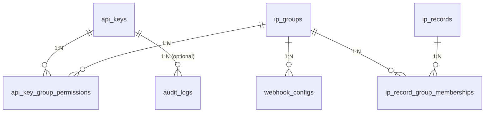

# Simply IP Vault - Database Schema & Entity Specifications

This document defines the complete database schema for `simply_ip_vault`. All entities are managed through **SeaORM** (2.0+) and must remain strictly **SQL-agnostic** (compatible with SQLite, PostgreSQL, and MySQL).

---

## 📊 Entity Relationship Diagram

### Mermaid Diagram (For GitHub / Forgejo / Markdown Previewers)



### Compact ASCII Diagram (Narrow Layout)

```
       [api_keys]
           │
           │ 1:N
           ▼
[api_key_group_permissions]
           ▲
           │ N:1
           │
      [ip_groups] ───► (1:N) ───► [webhook_configs]
           │
           │ 1:N
           ▼
[ip_record_group_memberships]
           ▲
           │ N:1
           │
     [ip_records]

  [api_keys] ───► (1:N) ───► [audit_logs]
```

---

## 📁 Tables & Entities Specifications

### 1. `api_keys`
Stores authentication tokens, global access rights, and CIDR network binding rules.

| Field | Type | Attributes | Description |
| :--- | :--- | :--- | :--- |
| `id` | `UUID` | Primary Key, Auto-Gen | Unique identifier for the API key |
| `name` | `String` | Not Null | Human-readable key description |
| `key_hash` | `String` | Not Null, Unique | Argon2 / SHA-256 hash of the secret API key |
| `signing_secret` | `Text` | Nullable | Per-key HMAC-SHA256 secret used to verify the `X-Signature-256` request header. Encrypted with XChaCha20-Poly1305 when `VAULT_ENCRYPTION_KEY` (alias `SIGNING_SECRET_KEY`, exactly 64 hex characters) is set, stored as `v1.xchacha20poly1305.<hex nonce>.<hex ciphertext‖tag>`; hex-encoded but unencrypted as `v1.plain.<hex>` otherwise. One legacy shape remains **readable and is never rewritten in place**: `aesgcm256:<hex nonce><hex ciphertext‖tag>` from the AES-GCM era, which moves to the current format on the next rotation — so upgrading is non-destructive and no migration touches secret material. **Any value carrying none of those three prefixes is rejected** as `MalformedCiphertext` (`500`) rather than read verbatim; see the fail-closed note below. `NULL` only for keys created before this column existed — such keys cannot authenticate and must be rotated. Never returned by any read endpoint |
| `prefix` | `String` | Not Null, Indexed | First 8 characters of key for display and fast lookup |
| `is_master` | `Boolean` | Default: `false` | Bypasses all group permission checks |
| `can_manage_keys` | `Boolean` | Default: `false` | Global privilege to create/edit/delete API keys |
| `can_manage_webhooks` | `Boolean` | Default: `false` | Global privilege to manage webhook configurations |
| `can_create_groups` | `Boolean` | Default: `false` | Global privilege to create new IP groups |
| `bound_ips` | `Text` | Nullable | Comma-separated CIDR ranges allowed to use this key (e.g. `127.0.0.1/32,::/0`) |
| `created_at` | `DateTimeUtc` | Not Null | Key generation timestamp |
| `updated_at` | `DateTimeUtc` | Not Null | Key last update timestamp |

---

*Credential model:* an API key is a **pair** of independent secrets. `key_hash` is a one-way hash of
the public `X-API-Key` (identity — never recoverable). `signing_secret` proves possession and
therefore **cannot** be hashed, since verifying an HMAC requires the secret verbatim; it is encrypted
at rest instead. Both are returned exactly once, by `POST /api/keys` and `POST /api/keys/{id}/rotate`.
`POST /api/keys/{id}/rotate` replaces both, so a compromised key leaves no working credential behind.
The cipher protecting this column is built **once at startup** from `VAULT_ENCRYPTION_KEY` and
carried in `AppState`; it is never re-derived per request. A malformed key aborts startup rather
than silently falling back to plaintext.

*Fail-closed decryption (2026-08-02):* `SecretCipher::open` accepts exactly the three prefixes above
and errors on everything else. An unprefixed value was previously returned verbatim as a
pre-prefix-era compatibility path; that is gone, because "no recognized prefix" identifies a
pre-prefix row only by assumption, while a truncated column, a half-written seal, a botched
migration, or a value written through an unrelated defect all reach the same branch — and each of
those ends with unknown bytes used as HMAC key material and nothing in the logs to say so. A
deployment still holding a bare secret must run `POST /api/keys/{id}/rotate-secret` before
upgrading, or that key stops authenticating.

`POST /api/keys/{id}/rotate-secret` replaces **only** `signing_secret`, leaving `key_hash`, `prefix`,
`name`, `bound_ips`, the global scope flags and every `api_key_group_permissions` row untouched — the
narrow operation for routine hygiene, and the recovery path for a `NULL` `signing_secret`.

---

### 2. `ip_groups`
Logical collections of IP rules (e.g. `fail2ban`, `sshd`, `vpn_whitelist`).

| Field | Type | Attributes | Description |
| :--- | :--- | :--- | :--- |
| `id` | `UUID` | Primary Key, Auto-Gen | Unique identifier for the group |
| `name` | `String` | Not Null, Unique, Indexed | Group name used in API requests and UI |
| `group_type` | `String` | Not Null, Default: `'banlist'` | Type of group: `'banlist'` or `'whitelist'` |
| `description` | `Text` | Nullable | Optional detailed description of the group's purpose |
| `created_at` | `DateTimeUtc` | Not Null | Group creation timestamp |

---

### 3. `api_key_group_permissions` (M:N Junction Table)
Maps fine-grained read, write, and delete permissions per API key and per IP group.

| Field | Type | Attributes | Description |
| :--- | :--- | :--- | :--- |
| `id` | `UUID` | Primary Key, Auto-Gen | Unique identifier |
| `api_key_id` | `UUID` | FK -> `api_keys.id` (CASCADE) | Associated API Key |
| `group_id` | `UUID` | FK -> `ip_groups.id` (CASCADE) | Associated IP Group |
| `can_read` | `Boolean` | Default: `true` | Permission to view IPs within this group |
| `can_write` | `Boolean` | Default: `false` | Permission to add/update IPs in this group |
| `can_delete` | `Boolean` | Default: `false` | Permission to remove IPs from this group |
| `created_at` | `DateTimeUtc` | Not Null | Assignment timestamp |

*Constraints & Indexes:*
- Unique Index: `(api_key_id, group_id)`

---

### 4. `ip_records`
Stores banned or whitelisted IP addresses and CIDR subnets.

| Field | Type | Attributes | Description |
| :--- | :--- | :--- | :--- |
| `id` | `UUID` | Primary Key, Auto-Gen | Unique record identifier |
| `target_address` | `String` | Not Null, Unique, Indexed | Valid IPv4/IPv6 address or CIDR range (e.g. `192.168.1.50/32`, `2001:db8::/32`), stored exactly as submitted. Unique so re-registration updates the existing row instead of creating a duplicate |
| `cause` | `Text` | Nullable | Reason for adding the IP record |
| `is_locked` | `Boolean` | Default: `false` | When `true`, the record cannot be modified or deleted through the API regardless of caller permissions. No endpoint currently sets this; it is a manual/administrative safeguard |
| `created_at` | `DateTimeUtc` | Not Null | Initial insertion timestamp |
| `updated_at` | `DateTimeUtc` | Not Null | Timestamp of the last field update (cause change or re-registration) |
| `last_seen_at` | `DateTimeUtc` | Not Null, Indexed | Timestamp of last re-registration or recorded activity |
| `is_deleted` | `Boolean` | Not Null, Default: `false`, Indexed | Soft-delete flag. A `true` row is hidden from every read (including the `iplist` export) and from webhook dispatch, but survives for the retention window so a master key can inspect or restore it |
| `deleted_at` | `DateTimeUtc` | Nullable, Indexed | When the soft delete happened; `NULL` while live. This — not `updated_at` — is what the purge measures against, so restoring and re-deleting restarts the retention clock |
| `deleted_by` | `Text` | Nullable | The `api_keys.id` (as text) of whoever soft-deleted the row. Deliberately **not** a foreign key: a FK would either block deleting that key or null the attribution out, and an attribution that disappears with its actor is not an attribution |

*Soft-delete lifecycle:*
- `DELETE /api/ips/{id}` soft-deletes. Non-master keys can only ever soft-delete; `?hard=true` is master-only and drops the row (cascading to `ip_record_group_memberships`).
- `GET /api/ips?include_deleted=true` is the master-only trash view. The flag is ignored for non-masters rather than rejected, and a master's *default* listing still hides deleted rows — the trash is opt-in.
- `POST /api/ips/{id}/restore` (master only) clears all three columns, so a restored row is indistinguishable from one never deleted.
- Re-registering a soft-deleted `target_address` via `/api/ban` or `/api/white` **resurrects** it rather than colliding with the unique index — otherwise a delete would permanently deny that address until the trash was emptied.
- `POST /api/system/purge-ips` (master only) and the background worker in `src/retention.rs` permanently drop rows where `is_deleted = true` **and** `deleted_at` is older than `IP_RETENTION_DAYS` (default **92**). Both conditions are required: matching on the timestamp alone would destroy restored records that kept a stale `deleted_at`.

*Note:* `DELETE /api/ips` (query/body form) is a different operation — it removes a record's membership in **one group** and leaves the record itself untouched. The `{id}` route above acts on the record as a whole.

---

### 5. `ip_record_group_memberships` (M:N Junction Table)
Associates an IP record with one or multiple IP groups.

| Field | Type | Attributes | Description |
| :--- | :--- | :--- | :--- |
| `ip_record_id` | `UUID` | FK -> `ip_records.id` (CASCADE) | Target IP Record ID |
| `group_id` | `UUID` | FK -> `ip_groups.id` (CASCADE) | Associated Group ID |

*Constraints & Indexes:*
- Primary Key: Composite `(ip_record_id, group_id)`

---

### 6. `webhook_configs`
Defines HTTP endpoints to notify when IP events occur within a specific group.

| Field | Type | Attributes | Description |
| :--- | :--- | :--- | :--- |
| `id` | `UUID` | Primary Key, Auto-Gen | Unique webhook configuration ID |
| `name` | `String` | Not Null | Human-readable name for the webhook |
| `target_url` | `String` | Not Null | HTTP/HTTPS target endpoint URL |
| `secret_token` | `String` | Not Null | Shared secret used to generate the HMAC SHA-256 signature (`X-Signature-256`). Empty string in the modes that compute no signature. Never returned by `GET /api/webhooks` |
| `auth_mode` | `Text` | Not Null, Default: `'CANONICAL_V1'` | How dispatches authenticate — one of `'CANONICAL_V1'`, `'BODY_ONLY'`, `'API_KEY_ONLY'`, `'NONE'` (see the table below). Unrecognized stored values fall back to `'BODY_ONLY'`, never to `'NONE'` |
| `api_key` | `Text` | Nullable | Value sent as the `X-API-Key` header by `'CANONICAL_V1'` and `'API_KEY_ONLY'`. A plaintext credential for the *receiving* system, so it is stored verbatim (there is nothing here to verify it against) and never returned by `GET /api/webhooks` — the listing reports only `has_api_key` |
| `hmac_template` | `Text` | Nullable, Default: `'{method}\n{path}\n{timestamp}\n{body}'` | The string signed in `'CANONICAL_V1'` mode. `NULL` means the default. Only meaningful for `'CANONICAL_V1'` |
| `headers_json` | `Text` | Nullable | Custom JSON key-value object of HTTP headers to inject into requests |
| `payload_template` | `Text` | Not Null | Template string with dynamic variables (e.g. `{"ip":"$target_address","group":"$group_name"}`) |
| `group_id` | `UUID` | FK -> `ip_groups.id` (CASCADE) | Monitored IP Group |
| `is_active` | `Boolean` | Default: `true` | Toggle to enable/disable webhook dispatching |
| `events` | `String` | Nullable | Comma-separated subset of `IP_ADD`/`IP_UPDATE`/`IP_DELETE` this webhook fires on. `NULL` means all events |
| `created_at` | `DateTimeUtc` | Not Null | Creation timestamp |

*Auth modes:*

| `auth_mode` | Signed message | Headers dispatched | Requires |
| :--- | :--- | :--- | :--- |
| `CANONICAL_V1` *(default)* | the resolved `hmac_template` | `X-Signature-256: <bare hex>`, `X-Timestamp`, and `X-API-Key` when `api_key` is set | `secret_token` |
| `BODY_ONLY` | `RAW_BODY` | `X-Signature-256: sha256=<hex>` | `secret_token` |
| `API_KEY_ONLY` | *(none)* | `X-API-Key` | `api_key` |
| `NONE` | *(none)* | *(none)* | — |

*`hmac_template` substitution rules:*

- Placeholders `{method}`, `{path}`, `{timestamp}`, `{body}` are replaced by their values. `{path}` is
  taken from `target_url` via `url.path()`. Any other `{...}` is literal text.
- `\n`, `\r`, `\t`, `\\` are escape sequences expanded to the characters they name; every other
  backslash sequence is kept verbatim. They are stored as two-character escapes because the template
  is edited in a single-line HTML input where a real newline cannot be typed.
- Both substitutions happen in **one left-to-right pass**, so a value substituted in is never
  rescanned — a request body containing the text `{path}` or `\n` cannot inject field boundaries into
  the signed string.
- A literal path written into the template (e.g. `{method}\n/api/hooks/42/execute\n{timestamp}\n{body}`)
  therefore overrides the `{path}` derived from `target_url`, which is what makes a receiver behind a
  path-rewriting reverse proxy verifiable without an extra column.
- `{body}` is mandatory (enforced with `400` at the API boundary): a signature that does not cover the
  payload is replayable across payloads.

---

### 7. `audit_logs`
Security audit trail tracking mutating operations across the application.

| Field | Type | Attributes | Description |
| :--- | :--- | :--- | :--- |
| `id` | `UUID` | Primary Key, Auto-Gen | Unique audit log entry ID |
| `api_key_id` | `UUID` | Nullable, FK -> `api_keys.id` (SET NULL) | Performing API key ID (Null if triggered by system auto-gen) |
| `api_key_name` | `String` | Nullable | Performing key's name, denormalized at write time so it survives that key later being deleted (unlike `api_key_id`, never nulled out by the FK's `SET NULL`) |
| `api_key_prefix` | `String` | Nullable | Performing key's prefix, denormalized for the same reason as `api_key_name` |
| `client_ip` | `String` | Nullable | Caller's resolved client IP (rightmost `X-Forwarded-For` hop, `X-Real-IP`, or raw TCP peer address) |
| `action` | `String` | Not Null, Indexed | Operation type, e.g. `IP_ADD`, `IP_UPDATE`, `IP_DELETE`, `KEY_CREATE`, `KEY_DELETE`, `KEY_UPDATE`, `KEY_ROTATE`, `KEY_SECRET_ROTATE`, `KEY_PERM_UPDATE`, `GROUP_CREATE`, `GROUP_DELETE`, `WEBHOOK_CREATE`, `WEBHOOK_DELETE` (non-exhaustive — any mutating action may log its own type) |
| `target_address` | `String` | Nullable | Target IP or CIDR range affected |
| `group_names` | `String` | Nullable | Comma-separated list of group names involved |
| `details` | `Text` | Nullable | Additional context or raw payload overview |
| `timestamp` | `DateTimeUtc` | Not Null, Indexed | Log creation timestamp |

---

## 🔄 SeaORM Enums & Custom Types

### `GroupType` Enum
- `Banlist` (Mapped to string `"banlist"`)
- `Whitelist` (Mapped to string `"whitelist"`)

---

## ⚡ Database Indexing Summary

To ensure optimal query performance under high load, the following indexes are mandatory in migrations:

1. `api_keys.prefix`: Fast lookup during `X-API-Key` middleware header matching.
   (`signing_secret` is deliberately **not** indexed — it is only ever read via the row already
   located by `key_hash`, never searched on.)
2. `api_keys.key_hash`: Fast validation of exact key hashes.
3. `ip_groups.name`: Unique index for quick group resolution.
4. `ip_records.target_address`: Indexed for fast IP checking / duplicates.
5. `ip_records.last_seen_at`: Indexed for temporal filtering (`max_age` / `since` queries).
6. `ip_records.is_deleted`: Indexed — every normal read filters on it, so without this the soft-delete filter turns each listing into a full scan as the trash accumulates.
7. `ip_records.deleted_at`: Indexed for the retention purge sweep.
6. `api_key_group_permissions (api_key_id, group_id)`: Unique joint index for instant permission verification.
7. `audit_logs.action` & `audit_logs.timestamp`: Fast lookup for audit logs filtering.